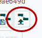
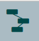

# project1SABD

## Index

- [Description](#Description)
- [Prerequisites](#Prerequisites)
- [Setting Up Environment](#Setting-Up-Environment)
- [Running Application](#Running-Application)


## Description
The project core consists in one jar which contains code and all dependencies, which is executed on a docker containers cluster
collocated on the same docker network. The involved containers are the following: a set of containers running hadoop cluster ,
particularly 1 master container and 3 worker containers,a single container executing NiFi, a single container executing HBase 
and 3 containers executing Spark cluster, involving 1 master and 2 workers.

## Prerequisites
In order to run locally you need the images of the containers used to run the application.The hadoop image is efferre/hadoop 

``` 
docker pull effeerre/hadoop

```  
The HBase image is harisekhon/hbase 

```
docker pull harisekhon/hbase

``` 
The NiFi image can be pulled in this way


```
docker pull apache/nifi

``` 
Finally in order to start the spark cluster you first need to run the following command, which creates the images of the spark master and  workers, building relative dockerfiles.

```
cd {rootProjectPath}/docker/docker-spark/docker-spark-cluster-master
chmod +x build-images.sh
sh build-images.sh

``` 
NOTE : In order to later run Spark cluster you need to have ``` docker-compose ``` installed.

## Setting Up Environment
Through "start-all.sh" script, you can run HDFS,NiFi and Hbase: it creates the network and start all the containers running them in the same network. You can subsequently create HBase tables for output results by running "init-hbase.sh". In order to see if all containers are up and running we can access the respective WebUI: http://localhost:9870 to access hdfs UI, http://localhost:16010/master-status to access HBase web UI, and finally http://localhost:9090/nifi to access NiFi Web UI (it may take a while for NiFi WebUI to become accessible after the container starts)

```
cd {rootProjectPath}/docker/
sh start-all.sh
sh init-hbase.sh

``` 
In order to see if the tables have been correctly created navigate through the HBase WebUI at the previous endpoint, and make sure they've been created before going into running the application.


## Running Application
Once the previous containers are up and running you can start with data ingestion phase by opening Nifi WebUI and loading the template under the path ``` {rootProjectPath}/docker/NIFI/TEMPLATE_NIFI/dataIngestionToHDFS.xml ``` . In order to do this on the panel 'Operate' in the left bottom corner, select the icon 

  

Once the template is loaded you need to add it to the canvas by drag and dropping the folliwing template icon located on the upper toolbar and then selecting the newly uploaded template

 


Now you can start the flow by clicking the play button,in the 'Operate' panel . After a while ingestion should be made and you could see the acquired files into HDFS by browsing the file system via WebUI. Now you can run the application, by typing the following commands

```
cd {rootProjectPath}/docker/docker-spark/
sh start-spark.sh

``` 
You can check the Spark cluster status and application execution through the spark master WebUI, available at http://spark-master:8080   

Once the application has correctly executed you can check the result by browsing the HDFS file system under ``` /output ``` pathe. In order to transfer the output data to HBase you need to switch to the NiFi WebUI again, remove the previous template (CTRL+A and DELETE option on UI) and upload the new ones under the following paths ``` {rootProjectPath}/docker/NIFI/TEMPLATE_NIFI/templateQuery1.xml  {rootProjectPath}/docker/NIFI/TEMPLATE_NIFI/templateQuery2.xml {rootProjectPath}/docker/NIFI/TEMPLATE_NIFI/templateQuery3.xml``` . For this templates you have to enable services: select UpdateRecord processor and the click the configuration icon on the 'Operate' panel, go to Properties tab and click the little arrow on the right of the first property field: enable all the component by clicking on the lamp icon, on the right. Close and deselect processor component by clicking on a free canvas area. Now you can start the flows by clicking the play icon on the 'Operate' panel.

Once done, you should be able to interrogate HBase in order to get otput data. For example from HBase shell you may want to view the content of table Query1 ('Query1','Query2','Query3' are the available tables).

```
hbase(main) > t=get_table 'Query1' 
            t.scan

```


